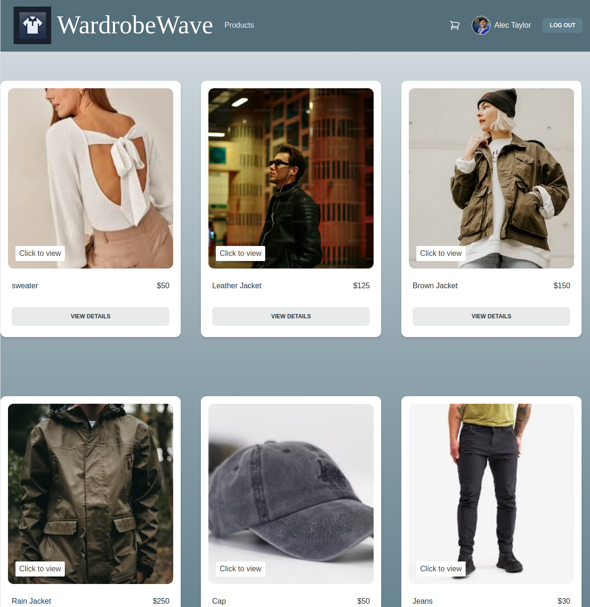
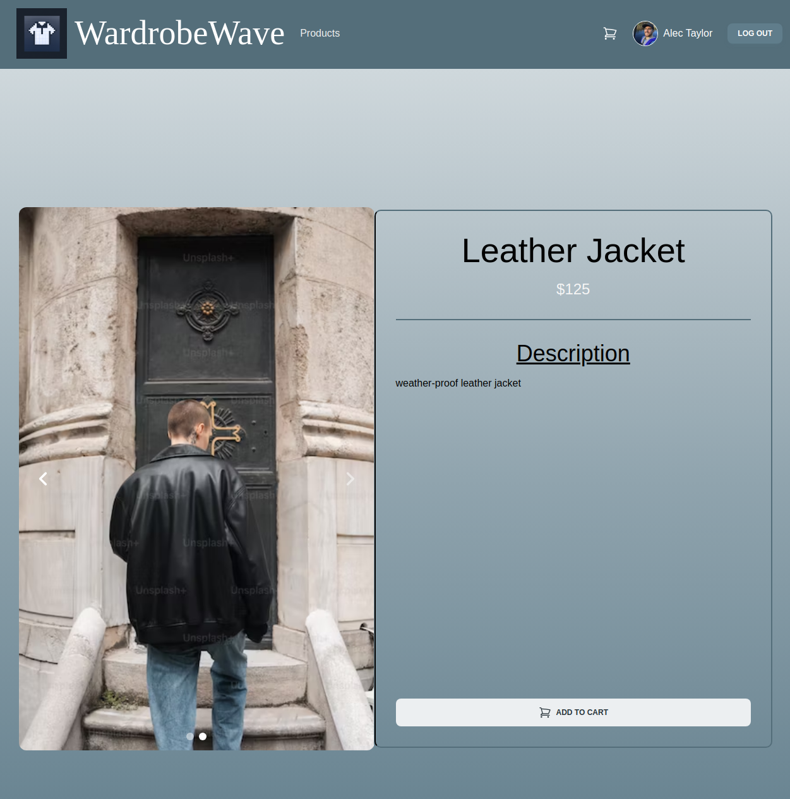
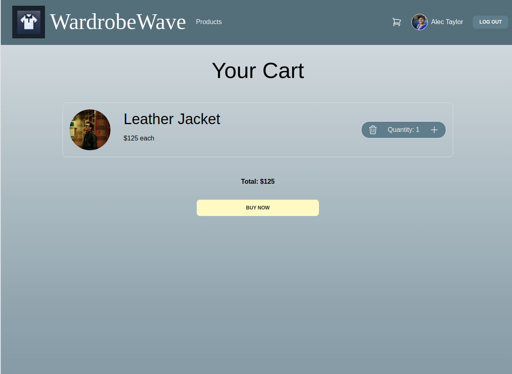

## Wardrobewave
Wardrobe Wave is your ultimate application for seamless and stylish online shopping in the world of fashion. Explore a vast collection of trendsetting clothing, for both men and women all curated to keep you on the forefront of style.  
With Wardrobe Wave, enjoy a user-friendly e-commerce experience, discover the latest fashion trends, and elevate your wardrobe effortlessly. 
## Screenshots

## Technologies Used
### Backend
1. Express.js
2. MongoDB
3. Node.js

### Frontend
1. React
2. Material Tailwind

### Deployment
1. Heroku- Backend
2. Netlify- Frontend

## Getting Started

[Deployed app](https://illustrious-dango-1a23f8.netlify.app)

[Trello board](https://trello.com/b/tRr82xws/project-3-planning)

## Next Steps
* Add responive design and mobile-friendly
* Add a category tab on the left and have products sorted by category
* Add ability to let users review a product and leave a rating with a comment
* Adding pagination to further organize products
* Adding an admin dashboard and functionality
* Use JWT for fetching user data
* Add a checkout page with payment info
* Use Stipe API to make secure card (fake) transactions 